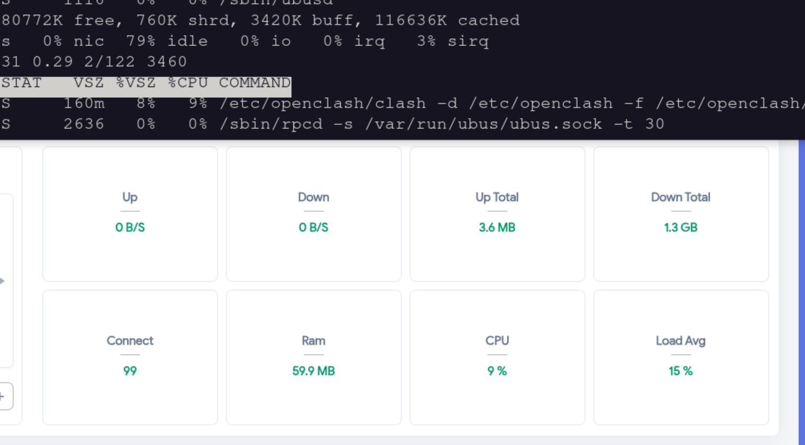

# Miemietron

Drop-in replacement for [mihomo](https://github.com/MetaCubeX/mihomo) (Clash Meta), rewritten in Rust for low-powered routers. Backend for [OpenClash](https://github.com/vernesong/OpenClash).

Same CLI. Same config. Same API. Just swap the binary.

## Performance

Tested with 3 devices. Running few Youtube live stream and few 4K video.



## Tested On

Only tested on vanilla OpenWrt with OpenClash. The firmware used for testing is [xwingswrt](https://github.com/xwings/xwingswrt). Other variants of OpenWrt (iStoreOS, ImmortalWrt, etc.) have not been tested and may have compatibility issues.

## Features

### Protocols
- **Shadowsocks** — AEAD (AES-128/256-GCM, ChaCha20-Poly1305) + SS2022 (2022-blake3-aes-256-gcm with multi-user EIH)
- **ShadowsocksR** — Stream ciphers + obfs + protocol plugins
- **VMess** — AEAD mode, AES-128-GCM / ChaCha20-Poly1305
- **VLESS** — TCP, TLS, WebSocket, gRPC, HTTP/2, Reality, XTLS-Vision
- **Trojan** — TCP, TLS, WebSocket, gRPC, Reality

### Transports
- **TLS** with browser fingerprinting (Chrome, Firefox, Safari, iOS, Android)
- **Reality** protocol (x25519, camouflage SNI)
- **WebSocket** with early data
- **gRPC** / **HTTP/2**

### SS Plugins
- **simple-obfs** (HTTP + TLS modes)
- **v2ray-plugin** (WebSocket)
- **shadow-tls** v2

### Network
- **TUN mode** with auto-route, iptables/nftables REDIRECT/TPROXY
- **TCP + UDP** relay (SS UDP with per-packet AEAD)
- **Inbound** — HTTP proxy, SOCKS5, mixed port, redir-port, tproxy-port
- **DNS** — FakeIP, DoH, DoT, UDP/TCP, anti-poison fallback, nameserver-policy, proxy-server-nameserver
- **Sniffer** — TLS SNI + HTTP Host extraction

### Rule Engine
Rules evaluated in config order (first match wins), matching mihomo behavior:
- Domain (exact, suffix, keyword, regex), IP-CIDR, GeoIP, GeoSite
- DST-PORT, SRC-PORT, NETWORK, PROCESS-NAME/PATH
- Logical AND, OR, NOT
- Rule providers (HTTP + file, RULE-SET inline expansion)
- MATCH (default)

### Proxy Groups
- **Selector** — manual with persistent storage
- **URL-test** — auto-select lowest latency
- **Fallback** — first alive proxy
- **Load-balance** — consistent-hashing, round-robin, sticky-sessions
- **Relay** — proxy chains

### REST API
Full mihomo-compatible API (40+ endpoints) for Yacd, Metacubexd, OpenClash.

### Operations
- Hot config reload via SIGHUP
- Config `log-level` honored (silent/error/warning/info/debug)
- Persistent proxy selection (`cache.db`)
- FakeIP persistence across restarts

## OpenClash Compatible

100% compatible with [OpenClash](https://github.com/vernesong/OpenClash):

```bash
# Download for your architecture
wget -O /etc/openclash/core/clash_meta \
  https://github.com/xwings/miemietron/releases/latest/download/miemietron-aarch64-unknown-linux-musl

chmod 4755 /etc/openclash/core/clash_meta

# Restart — OpenClash detects Meta core automatically
/etc/init.d/openclash restart
```

## Build

```bash
# Native
cargo build --release

# Static musl (for deployment)
cargo build --release --target x86_64-unknown-linux-musl

# Cross-compile for ARM64 routers
cross build --release --target aarch64-unknown-linux-musl
```

All builds are statically linked — single binary, zero dependencies.
See [BUILD.md](BUILD.md) for detailed build and deploy instructions.

## Usage

```bash
# Same flags as mihomo
miemietron -d /etc/openclash -f /etc/openclash/config.yaml

# Test config
miemietron -t -f config.yaml

# Print version
miemietron -v
```

## Target Platforms

| Target | Triple | Use Case |
|--------|--------|----------|
| x86_64 | `x86_64-unknown-linux-musl` | Soft routers, VMs |
| ARM64  | `aarch64-unknown-linux-musl` | MediaTek Filogic routers, RPi 3/4/5 |
## Architecture

See [CLAUDE.md](CLAUDE.md) for the full design document.

```
┌────────────────────────────────────────────────────────┐
│                      User Space                        │
│                                                        │
│  ┌──────┐  ┌────────┐  ┌──────┐  ┌──────────────┐    │
│  │ TUN  │─>│ System │─>│ Rule │─>│  Protocol    │    │
│  │(utun)│  │ Stack  │  │Engine│  │  Adapters    │    │
│  └──────┘  └────────┘  └──────┘  │SS/VMess/VLESS│    │
│      │                     │      │Trojan/SSR    │    │
│      │     ┌────────┐     │      └──────┬───────┘    │
│      │     │  DNS   │     │             │            │
│      │     │Resolver│     │      ┌──────┴───────┐    │
│      │     │FakeIP  │     │      │  Transport   │    │
│      │     └────────┘     │      │TLS/WS/gRPC/  │    │
│      │                    │      │H2/Reality     │    │
│      │                    │      └──────────────┘    │
│  ┌───┴────────────────────┴──────────────────────┐   │
│  │  HTTP/SOCKS5/redir/tproxy  │  REST API        │   │
│  └───────────────────────────────────────────────┘   │
│  ┌───────────────────────────────────────────────┐   │
│  │              tokio async runtime              │   │
│  └───────────────────────────────────────────────┘   │
└────────────────────────────────────────────────────────┘
```

## License

[MIT](LICENSE)
